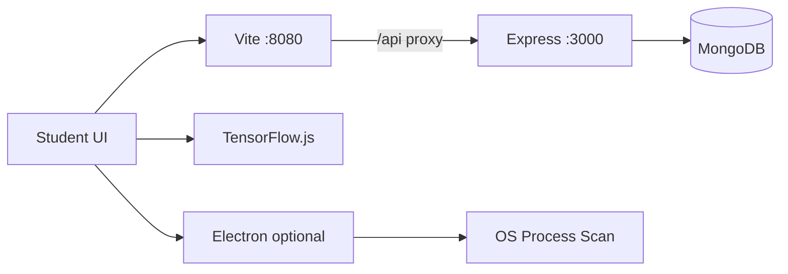

<div align="center">

# AI Anti-Cheating System (ExamShield)

**AI-powered online exam proctoring** — real-time webcam analysis, browser lockdown, audio monitoring, violation logging, and admin review dashboards.

[](https://react.dev/)
[](https://www.typescriptlang.org/)
[](https://www.tensorflow.org/js)
[](https://nodejs.org/)
[](https://www.mongodb.com/)

[Features](#-features) · [Demo](#-demo) · [Installation](#-installation) · [Usage](#-usage) · [API](#-api-reference) · [Architecture](#-architecture) · [Contributing](#-contributing)

**Repository:** [github.com/Sathvik257/AI-Anti-Cheating-System](https://github.com/Sathvik257/AI-Anti-Cheating-System)

</div>

---

## About

**AI Anti-Cheating System** is a full-stack exam integrity platform for schools and online assessments. Students take proctored exams in the browser (or optional Electron desktop app); the system detects suspicious behavior with **TensorFlow.js** (face + object detection), logs violations to **MongoDB**, and gives admins tools to review evidence and AI-generated risk summaries.

| Component | Path | Default |
|-----------|------|---------|
| Frontend | `AI-Exam/` | http://localhost:8080 |
| Backend API | `AI-Exam/backend-code/` | http://localhost:3000 |
| Database | MongoDB | Port `27018` (local) or Atlas |

---

## Features

### Student experience

| Feature | Description |
|---------|-------------|
| **Auth** | Register, JWT login, protected exam routes |
| **Pre-exam wizard** | Rules → device checks → calibration → blocked apps → start |
| **AI proctoring** | BlazeFace (faces/gaze) + COCO-SSD (phones, books, etc.) |
| **Audio monitor** | Mic level tracking, loud-noise violations (20% threshold) |
| **Browser lockdown** | Blocks tab switch, copy/paste, DevTools, right-click, screenshots |
| **Identity check** | Face enrollment + continuous verification during exam |
| **Exam timer** | Countdown with auto-submit on critical violations |
| **Dashboard** | History, scores, violation counts at `/dashboard` |
| **AI assistant** | In-exam coach, accessibility (large text, contrast, voice hints) |

### Admin experience

| Feature | Description |
|---------|-------------|
| **Admin dashboard** | All violations & sessions — `/admin` |
| **Analytics** | Charts & trends — `/analytics` |
| **Violation review** | Mark as `benign` (false positive) or `confirmed` |
| **AI session summary** | Risk score, flags, evidence timeline (OpenAI-compatible API) |
| **User management** | List users and exams via REST API |

### Platform

- Session **video recording** on submit
- **Multi-exam types** (quiz, coding, essay, mixed)
- Optional **Electron** shell for real OS process scanning (Teams, Zoom, Discord, etc.)

---

## Demo

> Add screenshots or a screen recording after deployment and place them here.

| Screen | Description |
|--------|-------------|
| Landing | Home page with login/register |
| Pre-exam setup | 5-step wizard with calibration |
| Live exam | Webcam + violation log + timer |
| Admin dashboard | Violations and session review |

```text
Suggested assets (add to repo later):
  docs/screenshots/landing.png
  docs/screenshots/exam.png
  docs/screenshots/admin.png
```

---

## Tech stack

```
Frontend     React 18 · TypeScript · Vite · Tailwind CSS · shadcn/ui
AI/ML        TensorFlow.js · BlazeFace · COCO-SSD
Backend      Node.js · Express · Mongoose · JWT · bcrypt
Database     MongoDB (local or Atlas)
Desktop      Electron 35 (optional)
Testing      Vitest · Testing Library
```

---

## Installation

### Prerequisites

- [Node.js](https://nodejs.org/) **18+**
- [MongoDB](https://www.mongodb.com/try/download/community) (local) or [MongoDB Atlas](https://www.mongodb.com/cloud/atlas)
- Webcam & microphone
- Chrome, Edge, or Firefox (HTTPS required in production)

### 1. Clone the repository

```bash
git clone https://github.com/Sathvik257/AI-Anti-Cheating-System.git
cd AI-Anti-Cheating-System/AI-Exam
```

### 2. Install dependencies

```bash
# Frontend
npm install

# Backend
cd backend-code
npm install
cd ..
```

### 3. Environment files

**Never commit `.env` files.** Add them to `.gitignore` (already recommended).

**`AI-Exam/backend-code/.env`**

```env
MONGODB_URI=mongodb://localhost:27018/anticheating_exam
JWT_SECRET=replace-with-a-long-random-secret
PORT=3000
JWT_EXPIRES_IN=1h
FRONTEND_URL=http://localhost:8080

# Optional — admin AI summaries
OPENAI_API_KEY=
OPENAI_BASE_URL=https://api.openai.com
OPENAI_MODEL=gpt-4o-mini
```

**`AI-Exam/.env`** (optional in dev)

```env
VITE_API_URL=http://localhost:3000/api
```

In development, Vite proxies `/api` → `http://127.0.0.1:3000`, so you can skip `VITE_API_URL`.

**MongoDB Atlas:**

```env
MONGODB_URI=mongodb+srv://<user>:<password>@cluster.mongodb.net/anticheating_exam
```

### 4. Start services

**Terminal 1 — MongoDB (Windows)**

```powershell
cd AI-Exam
.\start-mongodb-27018.bat
```

**Terminal 2 — Backend**

```bash
cd AI-Exam/backend-code
npm run dev
```

**Terminal 3 — Frontend**

```bash
cd AI-Exam
npm run dev
```

Open **http://localhost:8080**

### 5. Create admin account

```bash
cd AI-Exam/backend-code
node create-admin.js
```

| Field | Default |
|-------|---------|
| Email | `admin@example.com` |
| Password | `admin123` |

Change these before production.

---

## Usage

### Application routes

| Route | Role | Purpose |
|-------|------|---------|
| `/` | Public | Landing |
| `/login` | Public | Login |
| `/register` | Public | Student signup |
| `/exam/setup` | Student | Pre-exam wizard |
| `/exam` | Student | Live proctored exam |
| `/dashboard` | Student | Exam history |
| `/admin` | Admin | Violations & sessions |
| `/analytics` | Admin | Statistics & charts |

### Run modes

**Browser only** — fastest setup; blocked apps use manual student confirmation.

```bash
# MongoDB + backend + frontend (see Installation)
```

**Electron + OS process scan** — detects Teams, Zoom, Discord, Slack, AnyDesk, TeamViewer, Webex.

```bash
cd AI-Exam
npm run dev              # Terminal A
npm run electron:open    # Terminal B (or npm run electron:dev for both)
```

**Frontend only** — UI works; login/API will fail without backend.

### Pre-exam flow (5 steps)

1. Accept integrity rules  
2. Check internet, webcam, microphone  
3. Calibrate lighting, face position, mic baseline  
4. Close blocked messaging/remote apps (`ProhibitedAppsGate`)  
5. Review summary → **Start exam**

### Proctoring layers

| Layer | What it does |
|-------|----------------|
| **OS (Electron)** | Scans running processes before exam |
| **Browser** | Tab switch, clipboard, DevTools, fullscreen, Print Screen |
| **Audio** | Loud noise above 20%, 5s cooldown |
| **AI vision** | Face count, gaze, obscured face, prohibited objects (~2s interval) |
| **Violations** | Timestamps, optional face screenshots, admin review workflow |

**Auto-submit triggers (examples):** multiple faces, tab switch (per exam policy).

---

## Architecture



<details>
<summary><strong>Project structure</strong></summary>

```
AI-Anti-Cheating-System/
└── AI-Exam/
    ├── electron/              # Desktop shell (process scan)
    ├── backend-code/          # Express API
    │   ├── server.js
    │   ├── routes/
    │   ├── controllers/
    │   ├── models/
    │   └── middleware/
    ├── src/
    │   ├── pages/
    │   ├── components/
    │   ├── hooks/             # useAIProctoring, useWebcam, …
    │   ├── contexts/
    │   └── lib/api.ts
    ├── vite.config.ts
    └── package.json
```

</details>

Deep dive: [AI-Exam/ARCHITECTURE.md](AI-Exam/ARCHITECTURE.md)

---

## API reference

**Base URL:** `http://localhost:3000/api`  
**Auth header:** `Authorization: Bearer <token>` (from login, stored as `auth_token`)

### Health

```http
GET /api/health
```

### Authentication

| Method | Endpoint | Auth |
|--------|----------|------|
| POST | `/api/auth/register` | No |
| POST | `/api/auth/login` | No |
| GET | `/api/auth/me` | Yes |
| POST | `/api/auth/logout` | Yes |

**Register example:**

```json
{
  "name": "Jane Student",
  "email": "jane@school.edu",
  "password": "securepass123",
  "studentId": "STU-001"
}
```

### Violations

| Method | Endpoint |
|--------|----------|
| POST | `/api/violations` |
| GET | `/api/violations` |

### Exams

| Method | Endpoint |
|--------|----------|
| POST | `/api/exams` |
| GET | `/api/exams/active` |
| GET | `/api/exams/:id` |
| POST | `/api/exams/sessions/start` |
| POST | `/api/exams/sessions/submit` |
| GET | `/api/exams/sessions/history` |
| GET | `/api/exams/sessions/:id` |

### Analytics

| Method | Endpoint |
|--------|----------|
| GET | `/api/analytics/violations` |
| GET | `/api/analytics/sessions` |

### Admin

| Method | Endpoint |
|--------|----------|
| GET | `/api/admin/violations` |
| GET | `/api/admin/violations/:id` |
| PATCH | `/api/admin/violations/:id/review` |
| GET | `/api/admin/sessions` |
| GET | `/api/admin/sessions/:id/ai-summary` |
| GET | `/api/admin/users` |
| GET | `/api/admin/exams` |

### MongoDB collections

| Collection | Stores |
|------------|--------|
| `users` | Students & admins |
| `exams` | Exam definitions |
| `examsessions` | Sessions, scores, recordings |
| `violations` | Events + review status |

---

## Scripts

### Frontend (`AI-Exam/`)

| Command | Description |
|---------|-------------|
| `npm run dev` | Dev server → :8080 |
| `npm run build` | Production build → `dist/` |
| `npm run preview` | Preview production build |
| `npm run lint` | ESLint |
| `npm test` | Vitest |
| `npm run electron:dev` | Vite + Electron |
| `npm run electron:open` | Electron only |

### Backend (`AI-Exam/backend-code/`)

| Command | Description |
|---------|-------------|
| `npm run dev` | Nodemon → :3000 |
| `npm start` | Production server |
| `node create-admin.js` | Seed admin user |

---

## Deployment

1. Build frontend: `cd AI-Exam && npm run build`
2. Host `dist/` behind **HTTPS** (required for camera/microphone)
3. Deploy backend with production `MONGODB_URI`, `JWT_SECRET`, `FRONTEND_URL`
4. Set `VITE_API_URL` to your public API URL
5. Rotate default admin password
6. Do not commit secrets; use environment variables on your host (Railway, Render, VPS, etc.)

| Resource | Approximate |
|----------|-------------|
| Bundle + models | ~2–3 MB |
| Model load time | 5–10 s |
| Detection interval | ~2 s |
| RAM (with models) | 100–200 MB |

---

## Troubleshooting

| Issue | Fix |
|-------|-----|
| `Cannot connect to server` | Run `npm run dev` in `backend-code` |
| MongoDB error | Start `start-mongodb-27018.bat` or fix `MONGODB_URI` |
| CORS / Failed to fetch | Use dev proxy (`/api`) or match `FRONTEND_URL` |
| No admin menu | Run `create-admin.js`, re-login, check `role: "admin"` |
| Camera blocked | Allow permissions; use HTTPS in prod |
| AI models slow | Wait for first download; check network |
| Blocked apps stuck | Use Electron or confirm each app manually |

More guides:

- [AI-Exam/RUN_PROJECT.md](AI-Exam/RUN_PROJECT.md)
- [AI-Exam/HOW_TO_LOGIN_AS_ADMIN.md](AI-Exam/HOW_TO_LOGIN_AS_ADMIN.md)
- [AI-Exam/NEW_FEATURES.md](AI-Exam/NEW_FEATURES.md)

---

## Contributing

Contributions are welcome.

1. Fork the repository  
2. Create a branch: `git checkout -b feature/your-feature`  
3. Commit changes: `git commit -m "Add your feature"`  
4. Push: `git push origin feature/your-feature`  
5. Open a Pull Request against `main`

Please do not commit `.env`, credentials, or API keys.

---

## Security & privacy

- Exam monitoring requires explicit student consent (rules step)
- Violation screenshots are face-focused evidence for review
- JWT tokens stored in `localStorage` — use HTTPS in production
- Admin AI summaries are **advisory**; they do not auto-fail students
- Review workflow supports false-positive marking (`benign`)

---

## License

This project is **private and proprietary** unless the repository owner publishes an open-source license.

---

## Author & links

- **GitHub:** [@Sathvik257](https://github.com/Sathvik257)
- **Repository:** [AI-Anti-Cheating-System](https://github.com/Sathvik257/AI-Anti-Cheating-System)

If this project helps you, consider giving it a **star** on GitHub.

---

<div align="center">

**Built for secure, fair online examinations with transparent admin review.**

</div>
